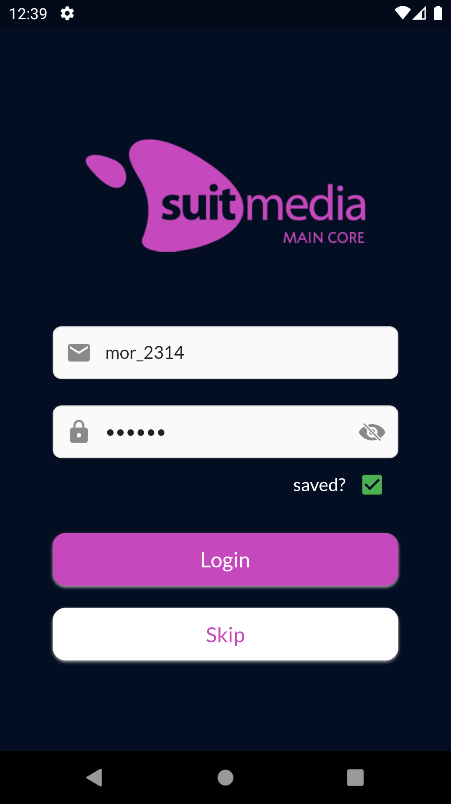
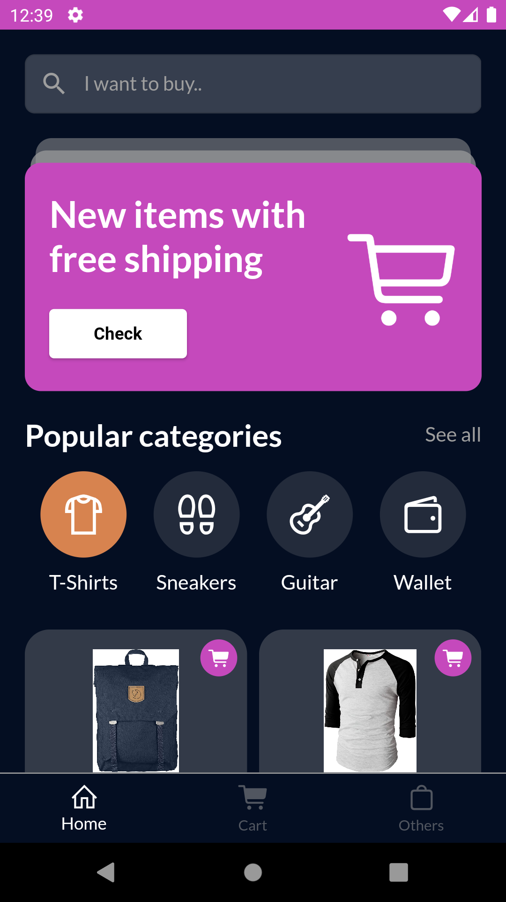
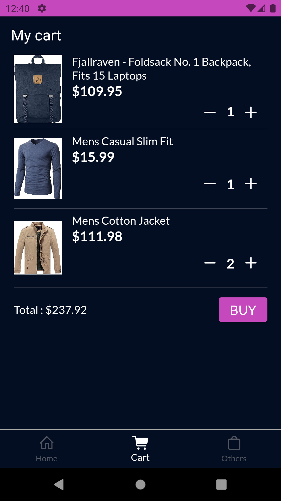
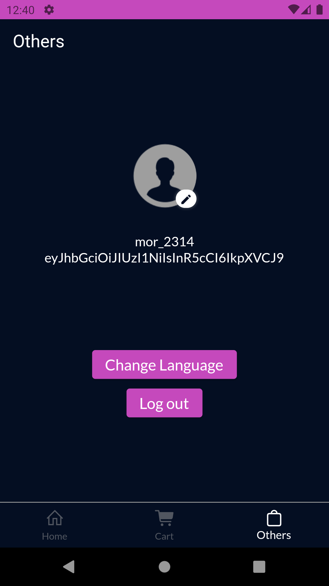

# Dummy Account

username : mor*2314 password : 83r5^*
 

# Preview

 

# Suitcore Flutter GetX

Suitmedia Mobile's Flutter Boilerplate Project.

- GetX state management
- GetX List pull to refresh and infinite scroll

Copyright ©2021 Suitmedia. All rights reserved.

References

- [Lab: Write your first Flutter app] (https://flutter.dev/docs/get-started/codelab)
- [Cookbook: Useful Flutter samples] (https://flutter.dev/docs/cookbook)
- [GetX: Reference] (https://pub.dev/packages/get)

For help getting started with Flutter, view our
[online documentation](https://flutter.dev/docs), which offers tutorials,
samples, guidance on mobile development, and a full API reference.

# suitStore
